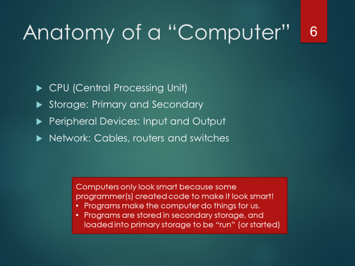

[TOC levels=4 numbered]: # "Class01"

- [Class01](#class01)
  - [Objectives](#objectives)
- [Accessing Course Content](#accessing-course-content)
- [Introduction to Programming (and Python)](#introduction-to-programming-and-python)
  - [What is a program?](#what-is-a-program)
  - [The Python Programming Language](#the-python-programming-language)
  - [Why learn Python?](#why-learn-python)
  - [More background on Python](#more-background-on-python)
  - [Python Enhancement Proposals (PEPs)](#python-enhancement-proposals-peps)
  - [Python Terms](#python-terms)
    - [Why do this? Don't be a Pakled.](#why-do-this-dont-be-a-pakled)
- [Getting to Know Your Computer](#getting-to-know-your-computer)
  - [What happens when you "run" a python program](#what-happens-when-you-%22run%22-a-python-program)
- [Introduction to the command line, terminal, and shell](#introduction-to-the-command-line-terminal-and-shell)
  - [Setting the historical context](#setting-the-historical-context)
    - [So, terminal or console?](#so-terminal-or-console)
    - [What about shells?](#what-about-shells)
    - [You will need to know the basics of the Bash shell](#you-will-need-to-know-the-basics-of-the-bash-shell)
    - [Resources for learning Bash.](#resources-for-learning-bash)
- [Exercise01](#exercise01)
  - [Introduction to Git & GitHub](#introduction-to-git--github)
- [Exercise 02](#exercise-02)
    - [Creating and using GitHub account](#creating-and-using-github-account)
- [Exercise 03: Cloning course repos](#exercise-03-cloning-course-repos)
- [Summary](#summary)
- [In class work](#in-class-work)
  - [Practice Exercises](#practice-exercises)

# Class01

In this first class, I provide a (very) quick introduction to Python and computer programming, and then introduce command line interface, git/GitHub, and help students install the necessary software.

## Objectives

* Introduce Basic Computer Architecture and Command Line interface
* Introduce and install Git and GitHub
* Provide an introduction to application development and the role of programming and programming languages.
* Introduce Python (and the Anaconda Edition we'll be using)
* Introduce VSCode editor
* Develop your first program
* Create a GitHub account and join the Team Repos for this class.
* Clone the class repos into your project.
* Practice staging, committing, pushing and pulling project changes.
* Complete Assignment #1 and Quiz#1.

# Accessing Course Content

All content for this course is available via GitHub. 

Within GitHub, I've created an organization for ITM695x programming for managers.

You will be able to access this course content once you create your GitHub account (this will be an exercise that you will do a bit later on in this class). For now, just read the content found on the professors screen.

# Introduction to Programming (and Python)

## What is a program?

A program is a sequence of instructions to accomplish a task. A programming language is different than a "natural language" (i.e., English, French, Spanish); it's much more formal and meant to force the "speaker" of the language to be very specific. The "listener" of the language is the computer, and computers have difficulties with nuanced communication and thus require very detailed and accurate instructions on how to perform any task. NOTE: Computers only look smart because some programmer(s) make it look that way.

##  The Python Programming Language

The programming language you will be learning in this course is Python. There are many other languages out there. Some languages are general-purpose;  in that, they are meant to allow a programmer to create virtually any application, while others are more domain specific and focus on a subset of programs/application development (i.e., Mathematica, MatLab)

We classify Python as a "high-level" language. High-level languages are much easier to work with than low-level languages (such as assembler, and to some extent, C). Most programs are developed in high-level languages. Low-level languages are used to create programs that are "close to the machine" and involve things like creating device drivers, and specific applications to work with low-level features of a computer chip.

## Why learn Python?

There are literally [hundreds of programming languages](https://en.wikipedia.org/wiki/List_of_programming_languages) to choose from.

'Which language is more popular' is an often asked question. If you hear x language is the most popular, or y language has grown in use more than any other languages - such simple statements are often misguided. For instance, if you were working for a company that developed very low-level embedded systems (low-level programming) used by motherboard manufacturers, you'd look foolish proposing that the company switch it's language to Java (a high-level graphical programming language) because it was "more popular" than the current language the company was using (such as C, or assembler). So, when assessing what "the best language is," context matters.

That being said, in aggregate, Python is one of the [most popular programming languages](https://stackoverflow.blog/2017/09/06/incredible-growth-python/) used within "high income" countries (United States, United Kingdom, Germany, Canada, etc.).

Python is also particularly well suited for [data science, machine learning, and predictive analytics](https://stackoverflow.blog/2017/09/14/python-growing-quickly/) contexts - as well as Cybersecurity (ever watch Mr. Robot? When any code is shown, it's Python or Bash).

Python is one of the most accessible "professional level" languages to learn (by "professional level" I'm excluding languages that were developed purely for learning purposes, such as Alice).

Even if you don't plan to program, conduct data science/data analysis, or packet sniff or penetration test, etc. -- knowing a programming language may save your job, or help you get a new one.

This course will give you the necessary foundational knowledge of the language and tools so that you can more confidently access the many resources found on the internet to help you further develop your skills for whatever specialties you choose.

## More background on Python

Not named after the snake, but from Monty Python (The original creator of Python, Guido Van Rossum, was a big fan of Monty Python, and the  Python documentation and community can reflect this and be a bit humorous/whimsical)

Python has a unique culture and community based on its core design philosophy on readability and syntax that enables you to write concise programs.

##  Python Enhancement Proposals (PEPs)

* Python language development is managed through PEP's
    * https://www.python.org/dev/peps/
* Examples:
    * PEP0 provides index to the PEPS
    * PEP1 states the purpose of PEPS
    * PEP8 provides a style guide for python code
* PEP20 -- is known as the Zen of Python
  * Design principles for Python code
  * 20 aphorisms, but only 19 have been written down
  * Accessible from Python Shell
  * (exec. 'import this' from inside shell)

## Python Terms

* Code that fits the philosophy of Python is called **Pythonic**.
    * Pythonic has many positive connotations
    * Unpythonic is a negative term 
* Python practitioners are called Pythonistas, Pythonists (or other play-on-words of Python)

Before we get into learning Python and programming, there is much for us to set up and understand.

In this course, you will be creating a workflow using tools such as Git, GitHub, and VSCode. These are the tools that a modern professional programmer will use. Git/GitHub skills are themselves especially new and in high demand.

In the following sections we'll get to know a bit more about your computer, learn about terminals, consoles, and shells, about version control systems (Git) and code sharing repositories (GitHub), about documentation using markdown, and working with our development.

### Why do this? Don't be a Pakled.

# Getting to Know Your Computer

## What happens when you "run" a python program

A programmer creates Python code using an editor (we will be using an Integrated Development Environment which contains an advanced Python editor).

The editor saves this code in a .py file.

The python interpreter compiles the .py  so that the code will run on the local machine/hardware. Though Python is often referred to an Interpreted language (versus a compiled language), Python does, in fact, compile the code into bytecode that then runs on a Python Virtual Machine. After running/using a python model you'll often see a .pyc file, this is Python storing the compiled code in a bytecode file to save time and run faster in the future. If the code changes the .pyc will be updated).

The .pyc file contains bytecode – this cannot be read by humans, nor directly by the computer hardware, it's meant only to be read by the Python virtual machine.

The Python virtual machine reads the .pyc file and "runs" the program by translating the bytecode to local instructions specific to the "machine" (computing device which the program is running on)

# Introduction to the command line, terminal, and shell

Any "power user" (of a computer) will know how to navigate and use the command prompt/terminal. In this course, you will need to develop basic terminal skills. To get started, let's look at the history of computers and where the interrelated terms "terminal," "shell," "console" and "command prompt" come from.

## Setting the historical context

In the image below we find a PC on the left, and one of many "dumb terminals" on the right.

Before the development of personal computers, computer systems were large and centralized. Access to these large "mainframe" (and later "mini") computers were generally through what were called "dumb" terminals. These terminals had very little to no processing power, and simply "knew" how to display text and read input that would be sent across a wire to the central computer. These terminals where physical extensions of the main computer. Many terminals were connected to the same computer.

Terminals were used by programmers and users to accomplish tasks. You might access via a user console, an operator console, or an administrator console. Each of these offered particular uses of the main computer. So, initially, the console was the physical terminal device that users used to access the computer.

With the advent of the PC, both the processing (mainframe) and the console (terminal) were merged into one personal device.

Initial PCs were not multi-tasking. There was only one user, using a single console, who would start and run one program at a time.

As PC's evolved, their operating systems became more sophisticated, and we began to see a duplication of the mainframe architecture; that is, a user could have multiple "terminals" (in this case, they would use software, not hardware) and run multiple programs.

### So, terminal or console?

For modern computers, should we see ways of accessing the computer as a terminal? Or a console?

As we see from the historical context of the mainframe world, in a sense, we could use these terms interchangeably. When I'm working as an admin, I may open an admin console. This would be done by running terminal software. Frankly, though, these terms are often used synonymously.

### What about shells?

Now, we have a third term that is often used synonymously with the other two -- that is "shell."

When computers began having software terminals, the user needed a "language" to communicate with the computer. The language we use is presented as a user shell... a wrapper, in a sense, or what has become known as a shell (program), that provides a user interface (through a language) to the system.

On Linux, and most flavors of Unix, the most common shell is BASH (Born Again Shell). This is also the shell used in MacOS (which is an extension of Unix). Another popular shell is zsh (z-shell) - used commonly by developers in MacOS.(but there are others as well)

Microsoft and the general "PC" market did not evolve from Unix, and therefore developed a different technical approach to creating a terminal, and communicating via a shell to the core computer. There's no need to get into great detail about this for this class, other than to associate what we've already covered with how Windows handles things. In windows, you run either "CMD" or "PowerShell" to get terminal access to the computer.

In windows, our terminal and shell is commonly called the "command prompt," "command terminal," or "command shell" (NOTE: A prompt is simply a curser that indicates that system is waiting for input). Most modern versions of windows (especially the server variety) have another type of terminal access, that referred to as "Powershell."

### You will need to know the basics of the Bash shell

In this course, we will review a few commands so that you can become familiar with the basic commands available in Bash (NOTE: With the installation of Git on a PC, a Bash shell is also installed). Bash shells behave pretty much the same as the Bash shells found on any Unix (i.e., Linux), MacOS system, and Windows. Though our primary focus though will be on learning Python, knowing Bash will allow you better control of your computer.

### Resources for learning Bash.

There are nine basic bash commands you should familiarize yourself with:
`"
pwd
cd
ls
cat
cp
mv
rm
rmdir
mkdir
`"

To get help with any of these commands, simply add the command line switch --help. For instance, to get help on ls, type

`"
ls --help
`"

To run a program, you type the program name at the command prompt. For instance, if you wish to run a (non-compiled) version of a python program you're writing (which you've saved as hello.py), you would type the following.

`"
python hello.py
`"

Bash itself is also like a computer programming language. You will not be required to develop bash scripts in this course, but if you want to, you can quickly learn how to do such things. For a comprehensive introduction to the full "power" afforded by Bash, I'd suggest working through the examples found http://www.tldp.org/LDP/Bash-Beginners-Guide/html/Bash-Beginners-Guide.html, then here http://tldp.org/HOWTO/Bash-Prog-Intro-HOWTO.html and finally here http://www.tldp.org/LDP/abs/html/.

Also, there is a free course on Codeacademy (https://www.codecademy.com/learn/learn-the-command-line) that provides an excellent introduction to Bash.

# Exercise01

* Install Git (see git_install.md located in the ClassNotes/Class01 repository)
* Run bash
  * go to your home directory (`cd ~`)
  * go into your Documents directory (for Mac -> `cd Documents`, for Windows -> `cd "My Documents"`)
  * create a new folder call btest (`mkdir btest`)
  * change directory into this new folder (`cd btest`)
  * NOTE: You can always test to see which directory you are in by running the command `pwd` (which stands for **p**rint **w**orking **d**irectory)
  * using the "echo" command (this is a bash command that simply echos the given test to the output) and output redirection to create a new file called "about.txt" that contains your first and name (`echo "FName LName"> about.txt`)
  * now, move up one directory (`cd ..`)
  * Create a new directory called btest2 (`mkdir btest`)
  * Copy the content of `btest` into `btest2` 
  * remove the btest directory (`rm -rf btest`)
  * once you have finished, show the professor so that he can verify that you've done the work.
  

## Introduction to Git & GitHub

Git is a program used to manage code repositories. It provides strict version control, and
allows you to manage large projects and your ongoing work better.

VCS (Version Control Systems)/ CVS (Code versioning system) such as Git are incorporated into developer workflow. Within any professional programming environment, you will find a VCS is being used.

When writing programs you'll often collaborate with others to create an application. Developing large applications can be complex, often involving 100's of files of source-code, libraries and configuration files. Merely using a shared drive is not manageable -- as work can be easily lost when someone overwrites your work and does not merge it with their own work.  Even when not collaborating with others, developing software can often take months, or even years, of development effort. Managing all the files, updates to files, releases of the software, etc. can become very cumbersome and error-prone. This is where a VCS  can help significantly with the management of your application development.

Though there are a number of CVS's out there, Git has grown to be one of the most popular (partly attributed to GitHub, which provide server space to store code and share with others -- creating a community of "social coding" where people can "fork" and update your code, provide suggestions or updates (through "pull requests") -- all when maintaining fine-grained control over the history of changes to files.

The following two videos (10 and 15 minutes in length) provide a gentle introduction to Git and GitHub.

When managing files in Git, files begin as **untracked**. As files are added to tracking, then they are **staged**. The **staged** files are then **committed** to the repository (repo) with a **commit** command (you usually include a message).

When changing files that are tracked by Git, they enter a **modified** state. Once changes are ready to be added to the repos, **modified** files are **staged** and then **committed**.

If a mistake is made, we can roll-back any changes to a previous commit. Also, we can have various versions of our project in branches. A common pattern is to have three levels of staging. The development branch, the testing branch, and then the master "release" branch.

After exercise01 we should know have Git installed, let's practice using it and github

# Exercise 02

* Create a GitHub account using your UT email address (if you already have a GitHub account under another email address, create a new account under your UT address - you can copy any content you'd like into your other repos at a later time)
* Once you've created your account, send your professor an email with the subject GITHUB, and the body of the message containing your username and the email that you used (which, again, needs to be your UT address).
* As the professor received your emails, he will add yours to the class repository. Once this is done, you will see a number of class repositories. 
* start a bash command prompt 
* You will also need to make a few configuration changes to your local git configuration. Start a bash prompt and type the following:
  * Set username:
    * `git config --global user.name "Fname lname "`
  * Set email:
    * `git config --global user.email "MY_NAME@example.com" `
  * Finally, to avoid having to type passwords each time you try to access GitHub (we'll see how to do this later), configure Git to cache password:
    * `git config --global credential.helper cache`
    * The above command will default to caching the password for 15 minutes. You can extend this after if you'd like
      * `git config --global credential.helper 'cache --timeout=3600'`
      * NOTE: The above command will cache passwords for 1 hour.
* Once you have completed these commands, you can close your bash terminal.

### Creating and using GitHub account

Go to github.com and follow the procedure to create an account.
Send an email with your account information to the professor (tcsmith@ut.edu). The professor will add you to the class repositories. Once he as added everyone, the professor will demonstrate the basic navigation of the site.

# Exercise 03: Cloning course repos
* The professor will walk you through downloading our class repos into our project.
* Your personal repo (see you professor for your assigned repos name)
  * ClassNotes
  * Tests
  * Assignments

To download each of these, you will need to find the address for the GitHub repository.

Go to the class website found at github.com/ITM695-X

You should find a list of available repos.

You'll need to download each one of these. Go into the folder for the repo you want to download, and select "clone or download" and copy the web link that is shown.

Once you've copied this address, then you can clone this repository to your local drive.

Open a terminal in the directory that you will store your repos. 

ON the command line, for each repo, type the following:

`git clone <address of our repos>`

# Summary

Today we covered much ground. 

* Basics about computer operating systems, file systems, and command line interface
* Installation and introduction to Git and Git Hub
* Installation and introduction to Python (Anaconda Edition)
* Installation and introduction to the PyCharm IDE
* Integration between PyCharm IDE and Git/GitHub
* Setting up your GitHub account and cloning the class repos into your PyCharm project.
* Writing your first program ("Hello World")

# In class work

## Practice Exercises

Exercises are not marked. They are an opportunity for you to practice the material from class while getting support from the professor and peers.

>NOTE1: If you get stuck, you can reach out to fellow students and the professor. You will benefit most from this exercise is your first try on your own before seeking help. Trying to work through issues is how you develop your problem-solving skills.

>NOTE2: I will be looking for evidence that you've completed the exercises when determining your final class participation grade and repository management grade.

