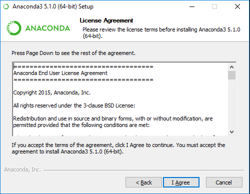
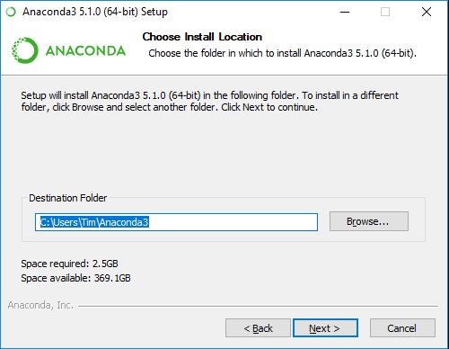
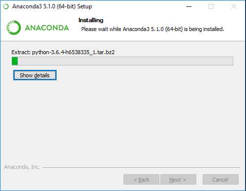
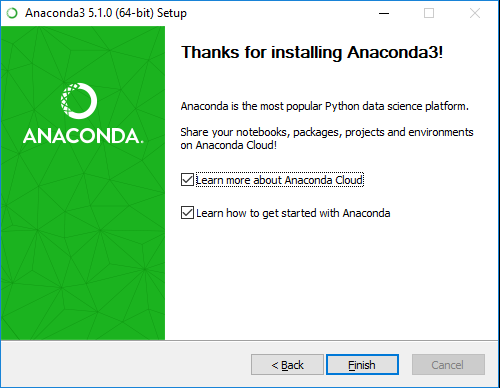

# Installing Anaconda

## The two major version of Python

There are two versions of Python, the 2.x series, and the 3.x series. Unlike most languages that retain backward compatibility, version 3.x python shed some of the old ways of working in python. This was necessary to clean up and refresh the language (other languages, such as Java, have retained backward compatibility, but it also creates a lot of complexity as new layers of ways of doing things are plastered on top of old ways. With Python's clean break from the past, there were free to make changes and not increase the complexity of working in the language by having to retain old ways of doing things. There was a downside to this approach though, and that is that early Python programs needed to be "ported" (a computer programming term for rewriting the program) for the new Python 3.x language. Also, programmers had to learn the new syntax and concepts, and many were reluctant. It has taken many years, but much of the Python codebase has been ported to version 3.x, and most programmers now use the new version.

## Anaconda

Anaconda is Python 3 with many of the common libraries used in data science added into one large install package. For this course, we'll be using the Anaconda version of Python. NOTE: This version of Python is no different than the official version of Python 3.x that can be found on Python.org - it just adds many pre-configured libraries.

## Download and install Anaconda

Download anaconda from the anacondo.org website. The download page is located
at https://www.anaconda.com/download/

On this screen, you should see the option to install either Python 3.6 or
Python 2.7. We will be using Python 3.6, so it's important that this is the
version your install.

Under Python 3.6, you may have the choice of 32-bit or 64-bit versions. Most modern computer(within the last 3-4) are 64 bit (if you don't know for sure, see here for how to check https://www.lifewire.com/am-i-running-a-32-bit-or-64-bit-version-of-windows-2624475)

Once downloaded (it's a large file) you need to go into your download directory and run the installation program.

The first screen you see should be as follows…

Click next:

The next screen is the License Agreement. Click agree if you agree.

Next, you'll be presented with the following screen. Unless you have reason to do otherwise, keep the default to "Just Me"

Next, you'll need to supply the location to install the application. Unless you have good reason to do otherwise, leave this to the default location already set.

On the next screen, just accept the default (as seen in this screen capture)

Select install, and now you will be presented with an install progress screen.

Once completed, you will be presented with the final screen. Select finish.

