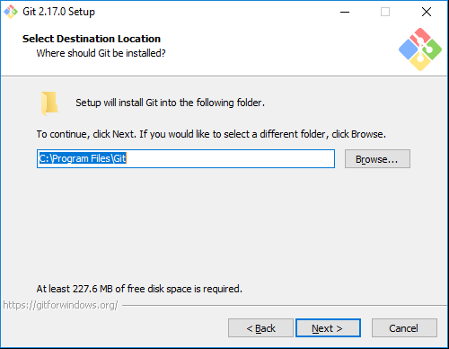
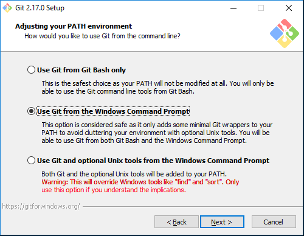

# Installing Git

Download Git from the following link https://git-scm.com/download/win

The web page should automatically begin downloading the correct version -- but, if you have
a 64-bit machine, make sure you're downloading the 64-bit edition (it will say in the
title of the download)

Select the appropriate installation program to install.

NOTE: You may get a pop-up window that asks if you approve this program to make changes
to your computer. Select yes. Once the installation is running, you'll see this initial
screen.

Select next. In the following screen, you'll be asked for the destination where the
program will be installed. Unless you have reasons to do otherwise (and you know well
the OS and filesystem) leave this to the default value.

Click next, and then you will be presented with the "select components" dialog.

Accept the defaults but add a check next to the last two options… as follows:

NOTE: MacOS and Linux will most likely not have the second last option. No need
to set this on those platforms.

In the next dialog box, keep the default settings.

In the next dialog box select Use Nano (Do NOT LEAVE THE DEFAULT TO VIM, unless
you're a "power user" who's had experience using VIM).

In the next window, accept the defaults.

Also, keep the defaults for the next dialog (which will look different, or not even asked,  on MacOS)

Leave the next screen at its default settings.

As well as the next (leave default settings)

And leave the next screen to its default settings and then click install.

Once installation begins, you'll see the following screen.

Then in the final screen, click finish.

