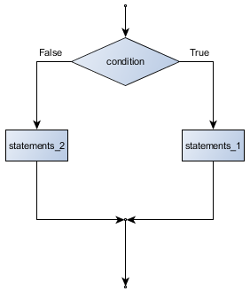
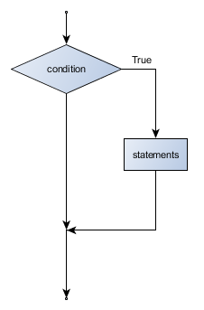
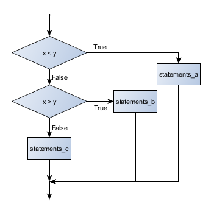
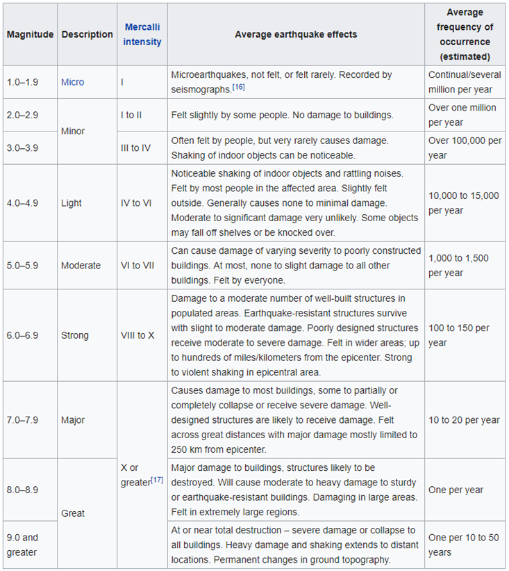
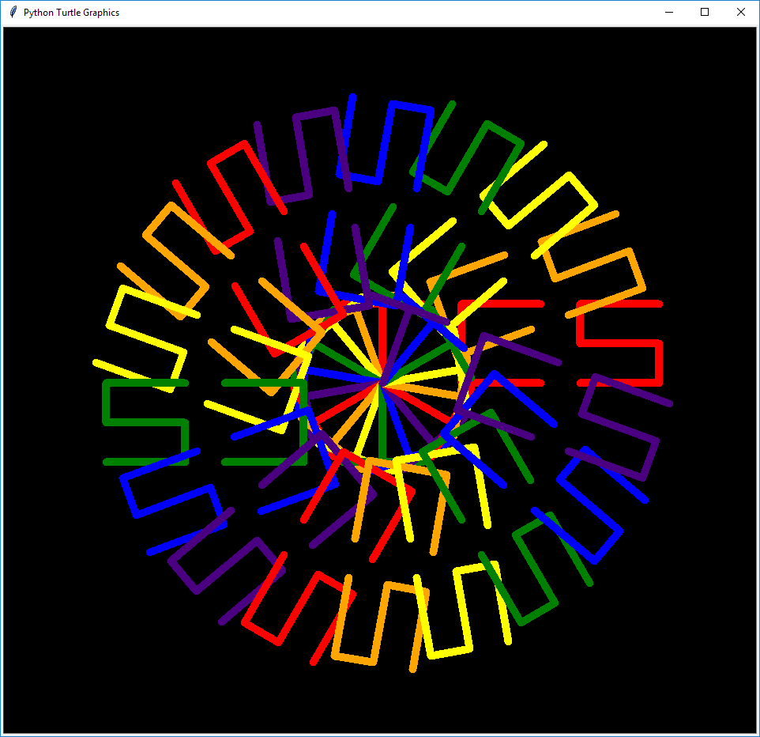

[TOC levels=1,2,3,4 numbered]: # "Class03"

# Class04
- [Class04](#class04)
- [Objectives](#objectives)
- [Topics](#topics)
- [Boolean values and Logical expressions](#boolean-values-and-logical-expressions)
- [define functions](#define-functions)
- [main program](#main-program)
- [C04Ex04](#c04ex04)

# Objectives
* Gain more practice and experience with the tools for this course (Python, Git, and VSCode)
* Understand the need for structure in programs, and what the three fundamental aspects of structured programming are. 


# Topics
    * Structured Programming
      * Sequence
      * Selection
        *   boolean expressions
        *   if, elis, else
      * Iteration
        *   for loops, while loops


# Boolean values and Logical expressions

As we saw in the previous class, some values in Python (and any programming languages) are boolean. The boolean type (or bool) can only take on one of two values, true or false.

So far, we have covered arithmetic and string expressions. Arithmetic expressions produce a number output (i.e. 1+2*4), a string expression produces a string output (i.e. "3"+"4"+"Hello).

There is a third type of expression that we'll call a logical expression. Logical expressions produce a boolean result. Logical expressions are very important in programming, as these expressions allow us to make decisions within out program. 

Boolean values are often "calculated" (much like arithmetic expressions) using a set of operators and a grammar. There are two categories of operators that are used in such expressions. The first are the `relational` operators. The second are the `boolean` operators.

```Interesting Fact: The name "boolean" comes from the British mathematician, George Boole. Boole first formulated rules for reasoning about and combining relationship checks. This work serves as the basis for all modern computer logic.```

## Relational operators

These operators compare two numeric values and produce a true of false response. These are questions about the relationship of two values. These operators include less than (`<`), less than equal (`<=`), greater than (`>`), greater than equal ('>'), equal (`==`), and no equal (`!=`).

NOTE: Notice that we use two equals signs next to each other to represent an equality check.  This is to make the distinction with assignment, which uses a single equals operator to indicate that a variable should be assigned a value that is found on the right.

* Test for equality
    * ` 1 == 2`

* Assignment
    * ` x = 1`


Using the Python console, we can test each of these relational operators:

```python
>>> 1 < 2
True
>>> 1 <= 2
True
>>> 1 > 2
False
>>> 1 >= 2
False
>>> 1 == 2
False
>>> 2 == 2
True
```

Here is a summary table of the logical operators in Python.

|   operator    | logical opposite  |
| :---:         | :---:             |
| <             |   >=              |
| <=            |   >               |
| >             |   <=              |
| >=            |   <               |
| ==            |   !=              |
| !=            |   ==              |


## Boolean operators

We often need to combine relational tests into a longer test of conditions. We do this using  `boolean operators`, these operators include **and**, **or**, and **not**.

To understand how these operators work, we can use what are called  `truth tables`.


### `and`

|   A   |  B    | A and B   |
| :---: | :---: | :---: |
| True  | True  | True  |
| True  | False | False |
| False | True  | False |
| False | False | False |

To see this in Python, let's look a python console session to test these conditions.

```python
>>> A = True
>>> B = True
>>> A and B
True
>>> A = True
>>> B = False
>>> A and B
False
>>> A = False
>>> B = True
>>> A and B
False
>>> A = False
>>> B = False
>>> A and B
False
```

### `or`

|   A   |  B    | A or B   |
| :---: | :---: | :---: |
| True  | True  | True  |
| True  | False | True  |
| False | True  | True  |
| False | False | False |

```python
>>> A = True
>>> B = True
>>> A or B
True
>>> A = True
>>> B = False
>>> A or B
True
>>> A = False
>>> B = True
>>> A or B
True
>>> A = False
>>> B = False
>>> A or B
False
```

## `!`

|   A   |  !A   |
|  :---: | :---: |
| True  | False |
| False | True  |

```python
>>> A = True
>>> not A
False
>>> A = False
>>> not A
True
```

Here are some examples:

```python
>>> 1 == 2 or 1 < 2
True
>>> x = 2
>>> y = 2
>>> x == y and x != y
False
>>> x = 2
>>> y = x
>>> z = y
>>> x == y and y == z
True
>>> x == y and y == z or False
True
```

# Structured programming

In the early days of programming, the use of "GoTo" statements was quite prevalent. Goto statements allow the programming to make an arbitrary jump to another part of the program. Though this was convenient, it resulted in rather messy code. As programs become larger and more complex, this messy code "held back" the progress of computers, large projects were consuming an exorbitant (and increasing) amount of time debugging. "Goto" statements resulted in programmers producing "messy code" that also resulted in difficulties in reading another programmers code; which contributed to the decreasing productivity as the size of programming projects grew -- and also made finding bugs very difficult.

In response, researchers started developing languages that eliminated the need for goto statements. One paper identified that any program can be written using three structures. 1) Sequence, 2) selection, and 3) iteration.

## Sequence

Sequence structures are simply parts of your program that run in a sequence, one line after the other. This is the only structure you've used thus far. 

```python
import math

width=80
print("*"*width)
print("*** Welcome to the area of a circle calculator -- the best area of a circle  ***")
print("*** program on the planet (or at least on part with the best                 ***")
print("*"*width)
print("\n\n")
radius = float(input("Please enter the radius of the circle: "))
print("\n\n")
print("The area of a circle with radius",radius, "is", math.pi*radius**2,".")
print("\n\n")
print("Thank you for using our program. If you'd like to make a donation, please send")
print("bitcoin to the the following address 0xA8...\n\n")
```

## Conditional Selection

Selection is a process of choosing one of possibly many blocks of code to run based on run time conditions. Programs are rather uninteresting and limited unless they test conditions and change behavior depending on runtime conditions.

NOTE: Portions of the following section are derived from "Thinking like a computer scientist" which is an open book project that is freely available on the Internet (and listed in the resource section of the course introduction)


### Conditional execution (Selection)

Selection structures are built using the Python keywords if, elif, and else.

#### Selection one of two branches using if/else

This is one of the more popular patterns you will find:



```python
x = 3
y = 4

if x == y:
    print("x and y are equal")
else: 
    print("a and y are not equal")
```

```python
x = 3
y = 4

if x != y:
    print("a and y are not equal")
else: 
    print("x and y are equal")
```

```python
x = 3
y = 4

if not x == y:
    print("a and y are not equal")
else: 
    print("x and y are equal")
```

#### Selecting if a branch will run, or not

We don't need to have an else with an if. Sometimes we just want to run a block of code based on if some condition is true.



```python
x = 10
y = 10
if x == y:
    print("Looks like these are equal")
```

#### Using elif statement to for chain selection

We can also chain things together to test multiple conditions using the elif statement.



```python
x = 10
y = 10


if x < y:
    print("x is less than y")
elif x > y:
    print("x is greater than y")
else:
    print("x and y are equal")
```

#### Nest if/else structures

We can also nest if/else within if/else structures;


```python
x = 10
y = 10

if x < y:
    if x > y:
        print("statement B")
    else:
        print("statement C")
else:
    print("Statement A")
```

# C04Ex01a

Write a program that asks a user to input a whole number.

If the number they entered is an even number, display “This is an even number”.

If the number entered is an odd number, display “This is an odd number”.

# C04Ex01b

Write a program that asks the user for a earthquake magnitude, and displays the description of an earthquake of the given magnitude.

The following table lists a description for various ranges of magnitude.



NOTE: Use an if, elif, elif, elif... and else structure

```python
if richter >= 8.0:
    print("Great")
elif richter >= 7:
    print("Major")
elif (...)

...

else:
    print("Micro")
```


## Iteration

Iteration is about repeatedly executing a block of code under some condition. We've already seen one iteration type in Python, that is the for loop.

### For loop

This example will print the numbers 0, 1, 2, 3 and 4:

```python

for i in range(5):
    print(i)

```

Using range with one argument (i.e. range(5)) creates an "iterable" that starts at 0 by default, and goes up to by not including the number given (5). Therefore, 0,1,2,3,4.

There are times though where we may wish to start our numbering from a number other than zero. If we include two arguments to range, the first one is the "start value", and the second one it the "up to and not including" end value.

This example will print the numbers 1 though 9:

```python
for x in range(1,10):
    print(x)
```

We can also add a third argument to the range function which is the increment value. For instance, the following code will print every second number starting at 1 and ending at 19.

```python
for x in range(1,20,2):
    print(x)
```

How do we count down? We can use the third argument, the increment and make it negative. 

The following code will start at 10, and count down up to, but not including, 0 (10,9,8,7,6,5,4,3,2,1)


```python
for x in range(10,0,-1):
    print(x)
print("BLASTOFF")
```


We can even nest for loops within for loops. The following program will print a rectangle with 5 rows of 10 asterisks.

```python
for row in range(5):
    for col in range(10):
        print('*', end='')
    print()
```
NOTE: The print statement can accept a number of arguments that change the behavior of print. Notice that the way we've used print up to this point leaves the cursor on the next line. Python print defaults to this behavior, but this can be overridden using the end='' argument. Print, by default, always adds an extra character to the end of the string being printed -- a new line character. To override this, we can set end='' whatever character we want. In this case, we set it to nothing -- which stops print from moving the cursor to the next line. 

For loops iterate over a list sequence. Any object that contains an iterable method can behave as such a list. `range()` has an iterable method, and is typically used when we want to create a traditional for loop. As we'll see later, data structures such as lists, tuples, and dictionaries also have an iterable method.


Python is a bit different from other languages wrt to the constraints used in for loops. When using a for loop in python we iterate through all the members of a sequence. As we have seen in the examples above, Python has a built in function called "range" that allows us to build sequences to iterate over.

```python
for x in range(0,5):
    print('x = ', x)
for x in range(10):
    print('x = ', x)
for x in range(5,10,2):
    print('x = ', x)
```

Python's approach allows us to do a number other convenient things -- like iterate through all members of any sequences- such as a tuple, a list, and even a string (these are data structures, and we've only covered string so far... but, we'll use list in an example below).

#### More on the Range function

NOTE: This section is adapted from http://pythoncentral.io/pythons-range-function-explained/

Pythons range() function generates a list, or sequence, of numbers. It's most often used to find the range for a for loop.

The range() function has two sets of parameters, as follows:

* range(stop)
  * stop: Number of integers (whole numbers) to generate, starting from zero. eg. range(3) == [0, 1, 2].
* range([start], stop[, step])
  * start: Starting number of the sequence.
  * stop: Generate numbers up to, but not including this number.
  * step: Difference between each number in the sequence.

Rules:
* All parameters must be integers.
* All parameters can be positive or negative.
* range() (and Python in general) is 0-index based, meaning list indexes start at 0, not 1. eg. The syntax to access the first element of a list is mylist[0]. Therefore the last integer generated by range() is up to, but not including, stop. For example range(0, 5) generates integers from 0 up to, but not including, 5 (aka 4).

```
>>> for i in range(5):
...     print(i)
...
0
1
2
3
4
>>> for i in range(10, 12):
...     print(i)
...
10
11
>>> for i in range(3, 15, 3):
...     print(i)
...
3
6
9
12
>>> for i in range(0, -6, -2):
...     print(i)
...
0
-2
-4
```


#### Using a for loop to loop through all characters in a  string

For loops not only work with the `range` function, but also allow us to walk through virtually any data structure that has multiple items. 

For instance, Python makes it trivial to loop through every character found within a string.

```python
for letter in 'ITM695':
  print('Current Letter :', letter)
```

We can find any length of string (this applies to other data structures such as Tuples, and Lists) using the len() method. We can use len() along with range() to do the following:

```python
s = 'ITM695'
for i in range(len(s)):
  print('Current Letter:',s[i])
```

NOTE: Any string (and as we'll see later, tuple, list, etc.) consists of multiple elements. To access an  individual element, we can use index notation. For example, if I have a string called name, I can access the first character using name[0], or the second character by using name[1]. In Python, and in all languages that I'm aware of other than R, the index starts at 0. (Think about it like this -- if you're on the 5th floor of a building, how many floors are you up? You're up 4 floors, not 5. In computer science, it's the distance from the start that we're interested in -- so, the first character is a distance of 0 from the start; much like the first floor is 0 floors up). We'll be covering indexing in much greater detail in a later class. 


# C04Ex02a

Write a program that prints all the even numbers from zero to an integer value given by the user. 

# C04Ex02b

Copy and update C04Ex02 to print all numbers that are both a multiple of 3 and 5.


### While Loops

While loops are the other common looping structure in Python.

#### Finite while loop:

Finite while loops are ones with a clearly defined terminating condition.

```python
count = 0
while count < 9:
   print('The count is:', count)
   count += 1
```

#### Infinite loop with terminating condition:

There are times when we need to create a loop that, though containing a clearly defined terminating condition, the termination of the loop is dependent on user (or file) input.

```python
num = 1
while int(num) != 0:
   num = input("Enter a number (0 to stop)  :")
   print("You entered: ", num)
```

__NOTE__ Obviously, use infinite loops with care.


### Controlling a loop via **break**, **continue** and **pass** statements

#### Break: Terminates current loop

Break example
```python
for letter in "ITM695":
    if letter == '4':
        break
    print(letter)
```

#### Continue: Stops executing the rest of the loop block, and starts next loop

The continue statement returns control to the beginning of a while loop.

Continue example
```python
while num > 0:
    num = int(input("Input a whole number less than 100: "))
    if num > 99:
        print("You entered a number that isn't less than 100.)
        continue
  print("Num = ", num)  
```

#### Pass: An empty, or null, statement that serves as a placeholder

Pass comment is basically a blank, do nothing statement, that is used where syntax dictates that a statement must exist, but you have no reason to include a statement.

Pass example
```python
for letter in "ITM695x-M19":
    if letter == 'x':
        pass # if we want to do nothing, we need to put a statement here, otherwise python will display an error
    else:
        print(letter,end="")

```


# C04Ex03 - Repeat asking for user input

Note the following pattern of repeatedly asking a user for input:

```python
while True:
    if (input("Do you wish to continue (y/n):)=="n"):
       break
    else:
       print("Ok, you'd like to continue... let me think about that. Ok, I'm done thinking. Next.")
```
Write a program that calculates the area of a circle. The program should ask the user for a radius value, if this value is negative, you terminate the program with a nice goodbye message. If they enter a non-negative number, you calculate the area, and then prompt the user again to enter another radius value.


## Functions

A function is a block of reusable code performs a task. Functions provide better modularity for your application and a high degree of code re-usability.

The advantages of using functions are:
  1. Reducing duplication of code (which helps reduce occurrence of errors/bugs)
  2. Decomposing complex problems into simpler pieces (but don't go overboard)
  3. Improving readability of the code (see second item comment about going overboard)

As we have seen already, Python gives us many built-in functions:
* We've been using functions already, i.e. print, pop, input. These are functions that have already been written for us.
* When using functions, we have a name and a set of parentheses. Inside the parentheses are the values (arguments) that we wish to have the function process.
    * print("This is an argument that will be processes by print")
    * print("This is an " + "expression " + "that creates a string that is sent to the function")
    * alist.insert(2, "example of function that accepts two arguments/values")

* See the extensive list of functions available in Python 3.5.2 [here](https://docs.python.org/3/library/functions.html).

> Python has "first class" functions: Specifically, a) in Python, a function is an object (we'll be exploring objects and classes more later). Like all objects they can be named. The "type" of function is applied to the object that name references. Python supports passing functions as arguments to other functions, returning them as the values from other functions, and assigning them to new names or storing them in data structures such as tuples,lists, and dictionaries. Python also supports anonymous functions (functionliterals). These are known as "lambda" functions


### Defining functions

A function is created with the def keyword. Unlike languages like Java, or C/C++, the indication of a block of code belonging to a function is through indentation (we've seen this already with loop structures).

```python
def circle_area(radius):
    return(3.14*radius**2)

print(circle_area(100)) # prints the area of a circle with radius 100
print(circle_area(25)) # prints the area of a circle with radius 25

```
The def keyword is followed by the function name with parentheses followed by a colon.

The function is later "called" when needed. The statements inside a function are not executed until the function is called.

To call a function, we specify the function name along with parentheses/round brackets.

Here is an example program to illustrate the use of a function (and other concepts we've covered thus far):

```python
# define functions

def get_float(prompt_msg, error_msg):
    while True:
        try:
            float_value = float(input(prompt_msg))
            break
        except ValueError:
            print(error_msg)
    return float_value


def calc_circle_area(radius):
    area = 3.14*radius**2
    return area

# main program

print("Welcome to area calculator")
while True:
    radius = get_float("Enter a radius value, or a negative number to quit: ", 
        "You must enter a floating point value. It looks like you did not do this. Please try again.")
    if radius < 0:
        print("Ok, we're done here.")
        break
    else:
        print("The area of a circle with radius " + str(radius) + " is " + str(calc_circle_area(radius)))

```

#### Functions must be defined before calling

We only call a function after it has been defined. Calling a function before it is defined will cause an error:

```python
f2()  # will generate error

def f2():
    print "f2()"
```

Function names are object names and can thus be reassigned or passed around like any other variable.

```python

def get_radius():
    print("====================================")
    radius = float(input("Please enter the circle radius: "))
    return radius


def calc_circle_area(user_input):  # user_input is a function that we will call to get user input
    area = 3.14*user_input()**2
    return area

print(calc_circle_area(get_radius))  # we are sending a reference to the function get_radius
```
### The return statement

You may have noticed the use of a `return` statement in the example functions above. A return statement specifies a value to be returned the the caller (remember, functions are `called` from other parts of the program). Functions calculate a result, for instance, should return a value. Not all functions need to return a value though, and as you will see in the examples below, you can define functions that do not return a value.

Let's say you want to create a function that calculates the future value of an investment. Clearly, you would want this function to return a value -- that is the calculated result from a present value invested at a given rate of return over a certain number of terms. 

```python
def FV(PV,r,n):
    return PV*(1+r)**n

print(FV(100,.1,1)) # prints the future value of $100 invested for one year at an annual rate of return of 10%
```

But, there are times when you don't need the function to return anything...

```python
def banner(str):
    print('*'*len(str+2))
    print('*'+str+'*')
    print('*'*len(str+2))

banner("Hello")

banner("World')
```

Now, if we mistakenly try to store the result of calling a function that doesn't return a value, Python will not generate an error, but instead return a special type called None (which means "nothingness").

```python
def banner(str):
    print('*'*len(str+2))
    print('*'+str+'*')
    print('*'*len(str+2))

x = banner("Hello")
print(x) # this will print "None" to the screen, because the banner function does not return a value
```


### Functions and argument passing

#### Send a single argument.

```python
def sqrf(x):
    return x*x

print(sqrf(3))
```

#### Send multiple arguments

>NOTE: Arguments are the values that we send to the function when we `call` the function. `parameters` are the list of values that the function receives -- as defined in the definition of the function.


We can send multiple arguments to a function by simply adding multiple parameters to our function definition:

```python
def add3(x,y,z):    # parameters are the variables that receive the argument values 
    return x+y+z

print(add3(1,2,3))  # 1,2,3 are arguments that are sent to the function when we call it
```

We can also change the order of which arguments are aligned with which parameter.

```python
def addf(x,y,z):
    print("x is " + str(x))
    print("y is " + str(y))
    print("z is " + str(z))
    return x+y+z


print(addf(1,2,3))
print(addf(z=1,y=2,x=3))
```

The output of which would be...

```
x is 1
y is 2
z is 3
6
x is 3
y is 2
z is 1
6
```

#### Define default values for arguments

```python
def mult2(x,y=1):
    return x*y

print(mult2(3,4))
print(multf(3))
```

# C04Ex04

Update your NameWriter program so that you have a function called draw_monogram that uses the turtle to draw your monogram on the screen starting at the current position and direction of your turtle. The function should accept the turtle that is on the screen, and will use this turtle to draw the monogram and then return the turtle back to it's original position and direction.

Now, use this function to generate some abstract art using your monogram.

Here is an example where the monogram TCS is printed 18 times, with each version starting with the turtle rotated, or spun, by 20 degrees.


The function should also return the turtle back to the position it was at when the the function was called (make sure you use penup to move it to this position without drawing, and leave the turtle with it's pen down.

NOTE1: see bob.setposition(x,y). bob.setheading(degrees), and to get the current position, bob.xcor(), bob.ycor())

NOTE2: To speed up the drawing, you can set the turtle speed to move faster. (see turtle.speed), change the color of the background (see turtle.bground) and the size of the pen (see turtle.pensize())


Now, use this function to generate some abstract art using your monogram.

Here is an example where the monogram TCS is printed 18 times, the starting position each time is 0,0, and each monogram is spun by 20 degrees, with a larger pensize, and cycling through a few colors.





